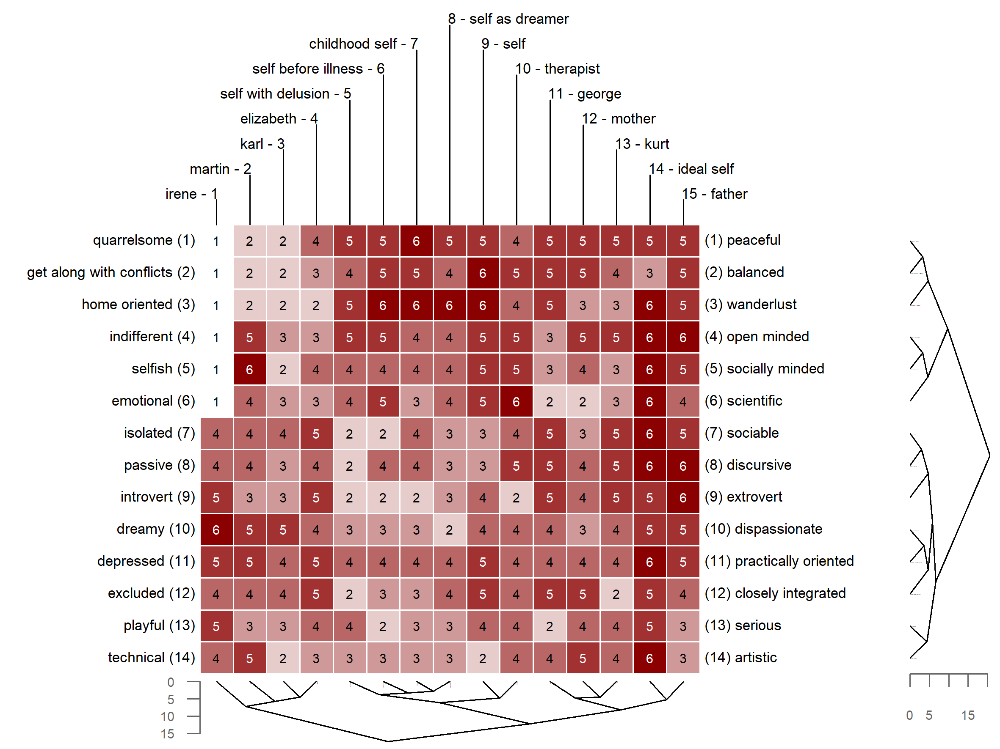

<style type="text/css">
code.r{
  font-size: 12px;
}
pre {
  font-size: 12px
}
</style>


```{r setup, include=FALSE}
knitr::opts_chunk$set(echo = TRUE, comment = "")
options(width = 200)
library(OpenRepGrid)
```

  
# Introduction

The [OpenRepGrid.ic R package](https://cran.r-project.org/web/packages/OpenRepGrid.ic/index.html) is a browser-based software to facilitate conducting *Interpretive Clustering* (IC). The R package [repertory grid](https://en.wikipedia.org/wiki/Repertory_grid) (often abbreviated *grid* or *repgrid*) data. The software is open source and available on all major operating systems. The package presented here is the workhorse on which other packages of the [OpenRepgrid project](http://openrepgrid.org/), for example [gridsampler](https://openresearchsoftware.metajnl.com/articles/10.5334/jors.150/) [@heckmann_gridsampler_2017] or *multigrid one* [@heckmann_using_2016] partially build upon.


# Repertory Grid Technique 

The repertory grid technique (RGT) is a data collection method which originated from *Personal Construct Theory (PCT)* [@kelly_psychology_1955]. It was originally designed as an instrument for psychotherapy to shed light on a client’s construction of the world. Over subsequent decades, the technique has been adopted in many other fields, including market, organizational, political, educational and sensory research [@fransella_manual_2004]. The data the RGT generates is *qualitative* and *quantitative*. On the qualitative side, the technique elicits the repertory of bipolar attributes (e.g. *smart vs. dull*, so called *constructs* in PCT terminology) an individual uses to make distinctions between entities of the world (e.g. different people, so called *elements* in PCT terminolgy). On the quatitative side, it requires rating each element on each elicited personal construct (e.g. *Martin* gets a score of 2 on the *quarrelsome = 1 vs. peaceful = 6* construct, indicating that Martin is quite quarrelsome). The result of the data collection procedure is a data matrix. The constructs are usually presented as matrix rows, the elements as columns and each cell contains the corresponding rating score. Figure 1 depicts a repertory grid data set, with the rows (constructs) and columns (elements) being clustered by similarity (see below for details). A thorough introduction to the repertory grid technique is given by @fransella_manual_2004.




# Available Software


Another reason for the choice of R is its growing ability to easily build graphical user interfaces (GUI) using, for example, the *shiny* [@chang_shiny:_2019] and other related R packages. The PCP community is on average not well-versed in programming. This translates into the need for easy to operate, GUI-based software. As shiny does not require knowledge of other web languages (i.e. CSS, HTML, JavaScript) to build a fully operational web application, R is also a suitable choice to fullfill this community need.


# Features

An up-to-date overview of all features implemented in the OpenRepGrid package can be found on the project’s documentation site (http://docs.openrepgrid.org.) and in the R package’s documentation files, accessible via [R Help](https://www.r-project.org/help.html). The implemented features include the following:

* *Data handling*: Importing and exporting grid data from different formats, sorting grids, several included datasets (e.g. the *boeker* dataset, see below)
* *Analyzing constructs*: Descriptive statistics, correlations, distances, PCA of construct correlations, cluster analysis, aligning constructs
* *Analyzing elements*: Descriptive statistics, correlations, distances, standardized element distances, cluster analysis
* *Visualization*: (Clustered) Bertin plots (i.e. heatmaps), biplots, clustering dendrograms
* *Indexes*: Intensity, complexity, PVAFF, measures of cognitive conflict, implicative dilemmas

In the remainder, three repgrid visualizations which are frequently used in publications and two types of statistical grid analyses are briefly outlined as feature examples. Figure 1 shows a Bertin diagram (i.e. heatmap) of a grid administered to a schizophrenic patient undergoing psychoanalytically oriented psychotherapy [@boker_reconstruction_1996]. The data was taken during the last stage of therapy. The data for this example is already included in the package. The ratings in the grid are color-coded allowing to spot similar rating patterns. Also, the grid was submitted to hierarchical cluster analysis, thereby reordering the constructs and elements by similarity as indicated by the dendrograms printed alongside the diagram. The following code creates the diagram shown in Figure 1.

```{r eval=FALSE}
bertinCluster(boeker, colors = c("white", "darkred"))
```

# Contributing

In order to maximize the package's usefulness for the grid research community, we welcome participation in the package's further development. Experienced R programmers are asked to make pull requests to the [OpenRepGrid github repository](https://github.com/markheckmann/OpenRepGrid), [report issues](https://github.com/markheckmann/OpenRepGrid/issues), or commit code snippets by email. Non-technical oriented researchers without programming knowledge are invited to send us feature requests or suggestions for collaboration, for example, to jointly to develop and implement a new repgrid analysis method. The goal is to make OpeneRepGrid useful for the majority of the repgrid community which will only be possible via research community participation.


# References


