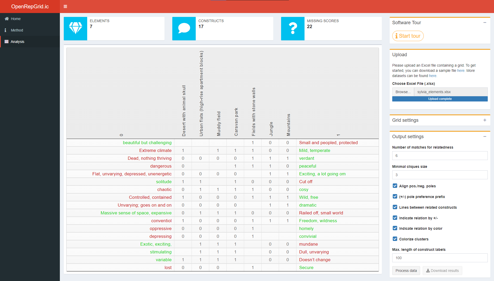

<style type="text/css">
code.r{
  font-size: 12px;
}
pre {
  font-size: 12px
}
</style>


```{r setup, include=FALSE}
knitr::opts_chunk$set(echo = TRUE, comment = "")
options(width = 200)
library(OpenRepGrid)
```

  
# Introduction

The [`OpenRepGrid.ic` R package](https://cran.r-project.org/web/packages/OpenRepGrid.ic/index.html) is a browser-based software to perform *Interpretive Clustering* (IC) for [repertory grid](https://en.wikipedia.org/wiki/Repertory_grid) data. The software accompanies our recent publication which describes the IC method in detail [[@burr_qualitative_2020]](https://doi.org/10.1080/14780887.2020.1794088). While IC can also be conducted by hand, using software support massively speeds up the process. The package presented here is part of the [OpenRepgrid project](http://openrepgrid.org/), which contains several software packages for the analysis of repertory grid data. In the following, we will give a brief example of how a repertory grid (often abbreviated as *grid* or *repgrid*) dataset can be analyzed using the `OpenRepGrid.ic` software.  


# Repertory Grid Technique 

The repertory grid technique (RGT) is a method which originated from *Personal Construct Theory (PCT)* [@kelly_psychology_1955]. It was originally designed as an instrument for clinical psychology but quickly spread to other disciplines like marketing, political, organization, educational research in the decades after its inauguration [@fransella_manual_2004]. The RGT is a person-centered method which focuses on understanding how an individual sees, or in constructivist terms *construes*, the world. The data collected by the RGT is both, *qualitative* and *quantitative*. The qualitative part of the data consists of a list of elicited bipolar attributes (e.g. *light-hearted vs. depressed*). These are called *constructs* in PCT terminology and constitute the templates a person uses to construe a set of objects under consideration (e.g. persons like *my father*, *my mother*; so called *elements* in PCT terminology). In a additional step, quantitative data is generated by assigning a score (e.g. from 1 to 6) for each element on each self-generated bipolar attribute (construct). For example, the element *my father* might receive a score of 2 on the *light-hearted = 1 vs. depressed= 6* construct, indicating the father is quite light-hearted. The results of the RGT are usually displayed as a constructs x elements matrix as shown in Figure 1 A more comprehensive introduction to the RGT can be found in  @fransella_manual_2004.


{ width=80% }


# Interpretive Clustering

IC is an idiographic method of interpretation which makes use of the qualitative and quantitative grid data. In addition to, for example, thematic analysis, IC not only takes into account the themes relevant in the participant's construing, but also the relation between the constructs via quantitative assessment. By assessing the constructs relations, implications which constructs hold for each other are identified. IC essentially identifies clusters of constructs which hold implications for each other. These clusters (or cliques) of constructs form the basis for a subsequent qualitative interpretation. We will provide a brief interpretation example below. The example builds on the analysis results the software generates as shown next. However, for a more thorough introduction to the IC method and comprehensive interpretations, the reader is referred to our publication [[@burr_qualitative_2020]](https://doi.org/10.1080/14780887.2020.1794088). 

# Running the software

The package can be downloaded from the CRAN repository via the R command `install.packages("OpenRepGrid.ic")`. The software is then started as follows.

```{r eval=FALSE}
library(OpenRepGrid.ic)
ic()
```

Alternatively, there is a web version available under https://ic.openprepgrid.org. Below a screenshot of the user interface is displayed.



The results of the IC analysis is not displayed interactively but is included into an MS Excel file that can be downloaded. Also the results of the intermediate IC steps as described in [@burr_qualitative_2020](https://doi.org/10.1080/14780887.2020.1794088) are contained. The main purpose of the software is to automate the cluster identification step of the IC procedure, which is a cumbersome and error-prone task if performed manually. In Figure 3, an extract of the analysis results using the grid data and settings as shown in Figure 2 are displayed and subsequently discussed.  

{ width=80% }


# Interpretation

>  TODO FOR VIV & NIGEL: Could you add a very brief interpretation example for (parts of) Sylvia's grid here (making reference to the image above)? Just enough so the reader can see why IC  may be interesting to perform and what one may learn. No need for comprehensiveness here. We only have several hunders words left.


# Contributing

In order to maximize the package's usefulness for the research community, we welcome participation in the package's development. Experienced R programmers are asked to make pull requests to the [`OpenRepGrid.ic` github repository](https://github.com/markheckmann/OpenRepGrid.ic), [report issues](https://github.com/markheckmann/OpenRepGrid.ic/issues), or commit code snippets. Non-technical oriented researchers are invited to send us feature requests or suggestions for improvement.


# References


