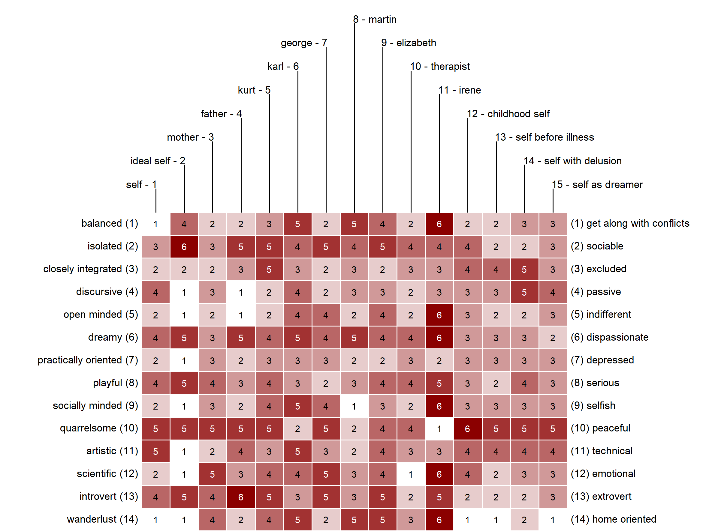
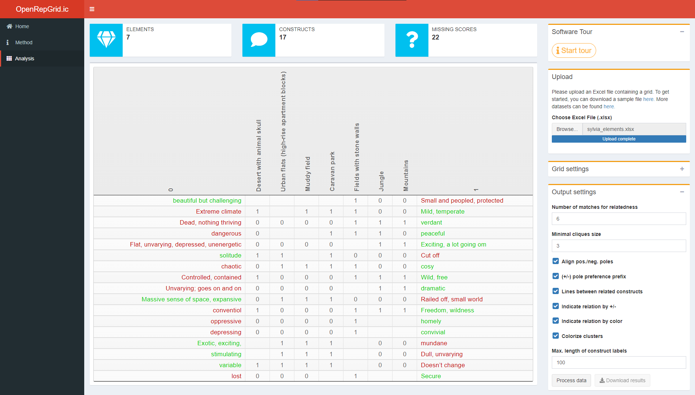

<style type="text/css">
code.r{
  font-size: 12px;
}
pre {
  font-size: 12px
}
</style>


  
# Introduction

The [`OpenRepGrid.ic` R package](https://cran.r-project.org/web/packages/OpenRepGrid.ic/index.html) is a browser-based software to perform *Interpretive Clustering* (IC) for [repertory grid](https://en.wikipedia.org/wiki/Repertory_grid) data. The software accompanies our recent publication which describes the IC method in detail [[@burr_qualitative_2020]](https://doi.org/10.1080/14780887.2020.1794088). While IC can also be conducted by hand, using software support massively speeds up the process. The package presented here is part of the [OpenRepgrid project](http://openrepgrid.org/), which contains several software packages for the analysis of repertory grid data. In the following, we will give a brief example of how a repertory grid (usually abbreviated as *grid* or *repgrid*) dataset can be analyzed using the `OpenRepGrid.ic` software.  


# Repertory Grid Technique 

The repertory grid technique (RGT) is a method which originated from *Personal Construct Theory (PCT)* [@kelly_psychology_1955]. It was originally designed as an instrument for clinical psychology but quickly spread to other disciplines like marketing, political, organization, educational research in the decades after its inauguration [@fransella_manual_2004]. The RGT is a person-centered method which focuses on understanding how an individual sees, or in constructivist terms *construes*, the world. The data collected by the RGT is both, *qualitative* and *quantitative*. The qualitative part of the data consists of a list of elicited bipolar attributes (e.g. *light-hearted vs. depressed*). These are called *constructs* in PCT terminology and constitute the templates a person uses to construe a set of objects under consideration (e.g. persons like *my father*, *my mother*; so called *elements* in PCT terminology). In a additional step, quantitative data is generated by assigning a score (e.g. from 1 to 6) for each element on each self-generated bipolar attribute (construct). For example, the element *my father* might receove a score of 2 on the *light-hearted = 1 vs. depressed= 6* construct, indicating the father is quite light-hearted. The results of the RGT are usually displayed a matrix of constructs times elements as shown in Figure xxx. A more comprehensive introduction to the RGT can be found in  @fransella_manual_2004.


{ width=80% }


# The IC method

The goal of the IC method is to. The reader is referred to our publication [[@burr_qualitative_2020]](https://doi.org/10.1080/14780887.2020.1794088) for a thorough introduction to IC. 


# Running the software

The package can be downloaded from the CRAN repository via the R command `install.packages("OpenRepGrid.ic")`. The software is then started as follows.


```r
library(OpenRepGrid.ic)
ic()
```

Alternatively, there is a web version available under https://ic.openprepgrid.org. Below a screenshot of the user interface is displayed.



The results of the IC analysis is not displayed interactively but is included into an MS Excel file that can be downloaded. Also the results of the intermediate steps as described in [@burr_qualitative_2020](https://doi.org/10.1080/14780887.2020.1794088) are contained. Below, an extract of the analysis results using the grid data and settings as shown in Figure 2 are displayed and subsequently discussed.

{ width=80% }


# Interpretation

TBD


# Contributing

In order to maximize the package's usefulness for the research community, we welcome participation in the package's further development. Experienced R programmers are asked to make pull requests to the [`OpenRepGrid.ic` github repository](https://github.com/markheckmann/OpenRepGrid.ic), [report issues](https://github.com/markheckmann/OpenRepGrid.ic/issues), or commit code snippets. Non-technical oriented researchers  are invited to send us feature requests or suggestions. 


# References


